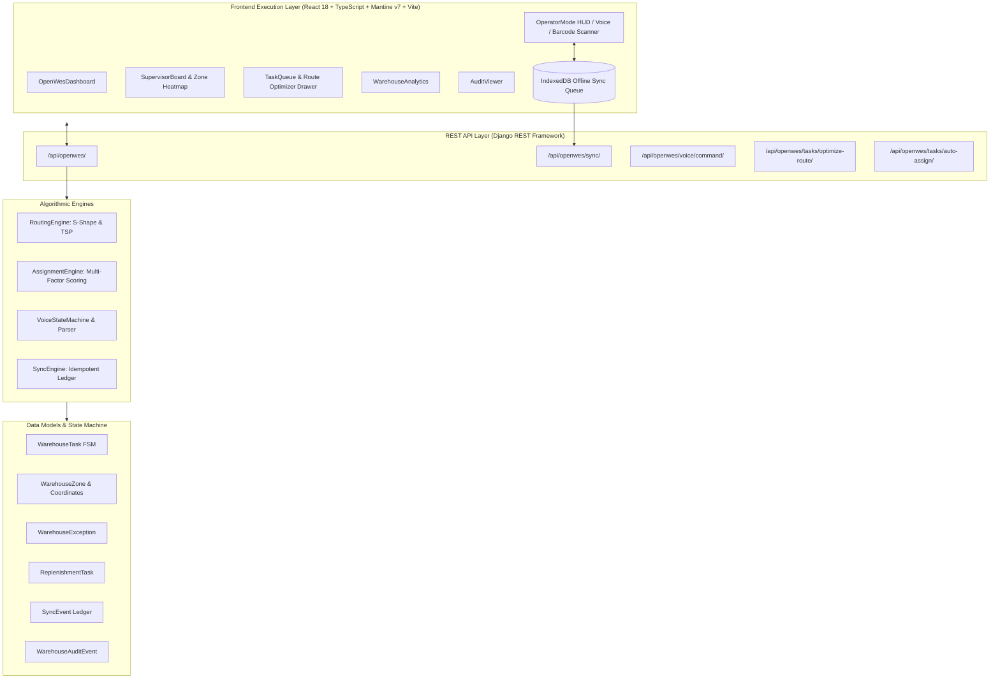

<div align="center">

# ⚡ VEYRA
### Verya — Inventory & Warehouse Management Platform
**Open-source based project, extensively redesigned and extended**

> *“I took an existing open-source inventory platform, studied its architecture, and substantially redesigned and extended it into Verya.”*

**An industrial-grade warehouse execution and floor orchestration platform.**  
*Voice-Directed Picking · S-Shape Route Optimization · Offline-First Sync · Multi-Factor Dispatch · Real-Time Heatmaps*

---

[](https://github.com/)
[](https://github.com/)
[](https://react.dev/)
[](https://www.djangoproject.com/)
[](https://opensource.org/licenses/MIT)

[⚡ Quickstart](#-quickstart) •
[📦 Standalone .EXE](#-standalone-windows-executable-exe) •
[🌐 Cloud Deployment](#-cloud-deployment-render-docker-vps) •
[🔑 Demo Credentials](#-client-demo-accounts--credentials) •
[🚀 Key Features](#-key-features) •
[🏗️ Architecture](#-system-architecture) •
[📖 Manual Setup](#-manual-setup-instructions) •
[👨‍💻 Developer](#-developer)

</div>

---

## 📌 Overview

**Verya** is an inventory and warehouse management platform built upon open-source foundations and substantially re-architected into an industrial-grade execution system.

> **Project Origin & Evolution:**  
> *“I took an existing open-source inventory platform, studied its architecture, and substantially redesigned and extended it into Verya.”*

**VEYRA (OpenWES)** bridges high-level inventory tracking with real-time floor execution, directing operators, optimizing travel routes, and orchestrating picking, replenishment, and supervision tasks in modern logistics hubs and fulfillment centers.

### Why VEYRA?
- **Zero Deadhead Walking**: Algorithmic pick-path generation using S-Shape (Snake) aisle traversal and Traveling Salesperson heuristics.
- **Hands-Free Operation**: Full voice-directed picking pipeline with speech recognition and audio synthesis.
- **Resilient Offline Mode**: IndexedDB local queue with idempotent deduplication ledger ensuring zero lost transactions during network drops.
- **Smart Dispatching**: Real-time task scoring incorporating travel distance, queue depth, priority, and zone affinity.
- **Complete Visibility**: Live floor supervisor heatmaps, operator performance analytics, and audit logging.

---

## 🚀 Quickstart

### ⚡ 1-Click Launch (Windows)

The repository includes ready-to-run automation scripts for rapid startup:

```cmd
# 1. Start both Backend & Frontend with browser launch
.\run.bat

# 2. Stop all running Veyra services cleanly
.\stop.bat
```

When started, VEYRA will be accessible at:
- 🌐 **Web Application:** [http://localhost:5173/](http://localhost:5173/)
- 🎯 **Operator HUD:** [http://localhost:5173/openwes/operator](http://localhost:5173/openwes/operator)
- 📊 **Supervisor Board:** [http://localhost:5173/openwes/supervisor](http://localhost:5173/openwes/supervisor)
- ⚙️ **Backend REST API:** [http://localhost:8000/api/openwes/](http://localhost:8000/api/openwes/)

---

## 📦 Standalone Windows Executable (.exe)

You can build and run VEYRA as a **single, standalone `.exe`** with a single command. The resulting executable is completely self-contained:
- **Zero Dependencies on Target Machine**: No Python, Node.js, Yarn, or virtual environments required to run the `.exe`.
- **Everything Bundled in a Single File**: Packages the Django backend, OpenWES engines, built React SPA frontend, static assets, migrations, and template database into `dist\Veyra.exe`.
- **Unified Single-Port Server**: Runs both the frontend web app and backend API on port `8000` (visiting `http://localhost:8000/` immediately serves the Veyra OpenWES application).
- **Portable & Persistent**: Automatically creates and persists your warehouse data, tasks, and media files inside a `./data` folder adjacent to `Veyra.exe`.
- **Automatic Browser Launch**: Launches the server, verifies migrations, and opens your default browser automatically.

### 🔨 Building the Executable

To build the executable, run the builder from the root of the repository:

```cmd
# Option 1: Double-click or run the Windows batch script
build.bat
# (or build_exe.bat)

# Option 2: Run with Python (auto-detects virtual environment)
python build.py
# (or python build_exe.py)
```

The build script will:
1. Automatically detect and use the project virtual environment (`.venv\Scripts\python.exe`).
2. Verify / install PyInstaller if needed.
3. Validate frontend static assets.
4. Compile and output the single executable to **`dist\Veyra.exe`**.

### 🚀 Running the Executable

Simply double-click or run:
```cmd
.\dist\Veyra.exe
```

When started, VEYRA will automatically open **`http://localhost:8000/`** with full access to:
- 🌐 **Dashboard & Web Application:** `http://localhost:8000/`
- 🎯 **Operator HUD:** `http://localhost:8000/openwes/operator`
- 📊 **Supervisor Board:** `http://localhost:8000/openwes/supervisor`
- ⚙️ **Backend REST API:** `http://localhost:8000/api/openwes/`

---

## 🌐 Cloud Deployment (Render, Docker, VPS)

Veyra is ready for 1-click cloud deployment on [Render](https://render.com/) or any Docker runtime:

- **1-Click Render Blueprint**: Connect your repository to Render -> Click **New Blueprint** -> Select [`render.yaml`](file:///c:/Users/MITHUN/Documents/Projects/Veyra/render.yaml).
- **Docker Container**: Uses [`Dockerfile`](file:///c:/Users/MITHUN/Documents/Projects/Veyra/Dockerfile) multi-stage container.
- **Native Python Service**: Uses [`render_build.sh`](file:///c:/Users/MITHUN/Documents/Projects/Veyra/render_build.sh) and [`render_start.sh`](file:///c:/Users/MITHUN/Documents/Projects/Veyra/render_start.sh).
- *See [docs/deployment.md](file:///c:/Users/MITHUN/Documents/Projects/Veyra/docs/deployment.md) for full deployment documentation.*

---

## 🔑 Client Demo Accounts & Credentials

Upon launch or deployment, Veyra automatically seeds realistic demo data and client evaluation user accounts:

| Role | Username | Password | Purpose & Workflow |
| :--- | :--- | :--- | :--- |
| **System Administrator** | `admin` | `admin123` | Full system superuser control, configuration, audit logs |
| **Warehouse Manager** | `manager` | `demo123` | Full operational control (Stock, Parts, Orders, Waves) |
| **Floor Supervisor** | `supervisor` | `demo123` | Live zone heatmap, task dispatching & exception resolution |
| **Scanner / HUD Operator** | `operator` | `demo123` | Zone A handheld scanner HUD & pick execution |
| **Client Evaluation Demo** | `demo` | `demo123` | Read-only evaluation account |
| **Senior Picker (Zone A)** | `op_rajesh` | `demo123` | Fast-pick electronics aisle & barcode scanning |
| **Voice Picking Operator** | `op_priya` | `demo123` | Hands-free voice-directed headset workflow |
| **Bulk Pallet Supervisor** | `op_deepa` | `demo123` | Pallet reserve replenishment & heavy stock |

---

## 🌟 Key Features

### 1. Operator Execution HUD
- **High-Contrast Interface:** Optimized for rugged warehouse handhelds, tablets, and vehicle mounts.
- **Barcode & Location Validation:** Real-time scan verification against expected SKU and bin location codes (e.g. `A-01-01`).
- **Voice-Directed Execution:** Web Speech API integration supporting hands-free confirmation commands (*"Confirm pick"*, *"Skip item"*, *"Quantity 5"*).

### 2. Intelligent Routing & Route Optimization
- **S-Shape (Snake) Traversal:** Calculates continuous path across aisles without backtracking.
- **TSP Heuristic:** Nearest-neighbor traversal minimization for multi-item pick batches.
- **Zonal Pick-Paths:** Groups items by warehouse coordinate system `(X, Y, Z)` to reduce operator transit times by up to 35%.

### 3. Multi-Factor Task Assignment Engine
Dynamic dispatch algorithm assigns the best operator using weighted scoring:
- **Travel Distance (35%):** Proximity to starting bin.
- **Queue Depth (30%):** Balances floor workload.
- **Order Priority (20%):** Expedites high-priority shipments.
- **Zone Affinity (15%):** Keeps operators in designated familiar aisles.

### 4. Offline-First Synchronization
- **IndexedDB Client Queue:** All scans, confirmations, and exceptions are queued locally in browser storage.
- **Idempotent Ledger:** Syncs transactions with unique UUID keys when reconnected to guarantee no double-deductions.

### 5. Supervisor Operations Board
- **Real-Time Heatmap:** Visualizes congestion and picking density across active warehouse zones.
- **Exception Resolution:** Instant manager approval workflow for short picks, damaged SKUs, and missing bins.
- **Audit Ledger:** Immutable event stream tracking every scan, override, and completion timestamp.

---

## 🏗️ System Architecture



---

## 📖 Manual Setup Instructions

If you prefer to run the services manually without `run.bat`:

### 1. Prerequisites
- **Python:** 3.10 or higher
- **Node.js:** 18.x or higher
- **Yarn / npm:** Package manager

---

### 2. Backend Setup (Django)

```bash
# 1. Activate the Python virtual environment
# On Windows:
.venv\Scripts\activate
# On Linux/macOS:
source .venv/bin/activate

# 2. Run database migrations
python src/backend/InvenTree/manage.py migrate

# 3. Seed demo warehouse data (zones, bins, operators, tasks)
python src/backend/InvenTree/manage.py seed_openwes_demo

# 4. (Optional) Run automated E2E test suite
python src/backend/InvenTree/manage.py test_openwes_e2e

# 5. Start the backend server
python src/backend/InvenTree/manage.py runserver 0.0.0.0:8000
```

---

### 3. Frontend Setup (React + Vite)

```bash
# 1. Navigate to the frontend directory
cd src/frontend

# 2. Install dependencies (if not already installed)
yarn install

# 3. Launch Vite development server
yarn dev --host 0.0.0.0
```

Once both servers are running:
- Open your browser to **`http://localhost:5173/`**
- Login with `admin` / `inventree` or any of the operator credentials above.

---

## 🛠️ Tech Stack

| Layer | Technologies |
|---|---|
| **Frontend** | React 18, TypeScript, Vite, Mantine UI v7, Tabler Icons, TanStack Query, Zustand, Web Speech API |
| **Backend** | Python, Django, Django REST Framework, Django Q |
| **Database** | SQLite (Default Dev) / PostgreSQL (Production ready) |
| **Storage & Sync** | IndexedDB (Client offline queue), REST API sync endpoints |
| **Optimization** | S-Shape Aisle Routing, Nearest-Neighbor TSP, Multi-Factor Scoring |

---

## 👨‍💻 Developer

**Developed and maintained by:**
- **Mithun** — Lead Developer & Architect

---

## 📄 License

This project is licensed under the [MIT License](LICENSE).
