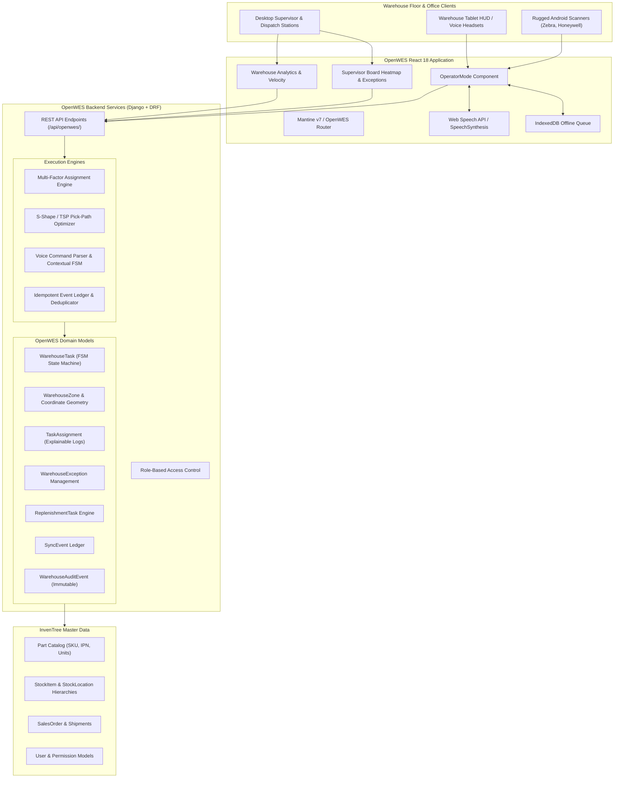
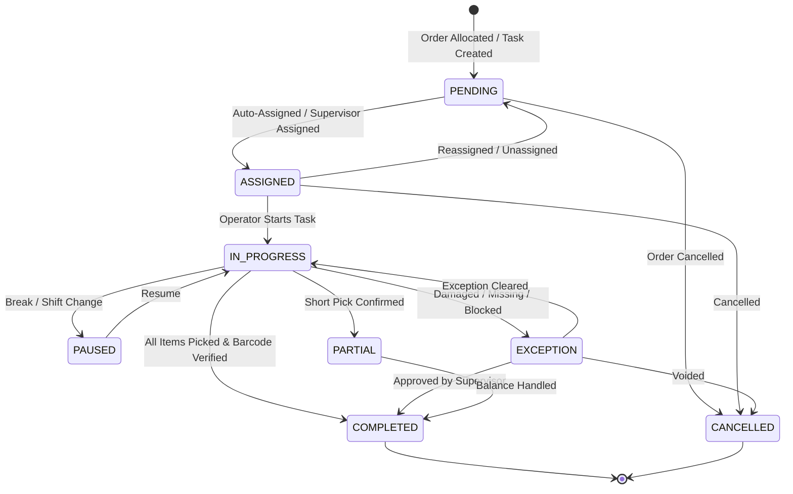
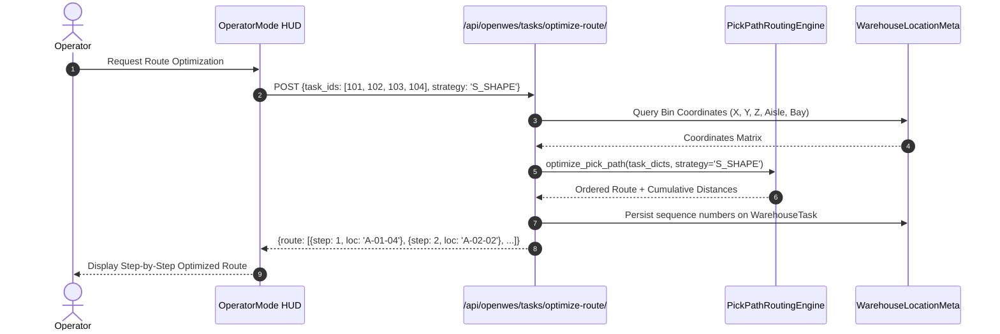
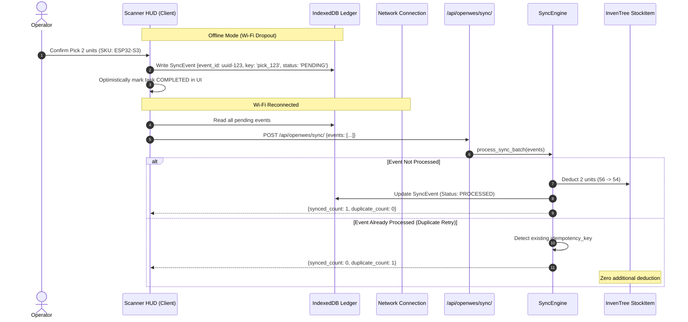
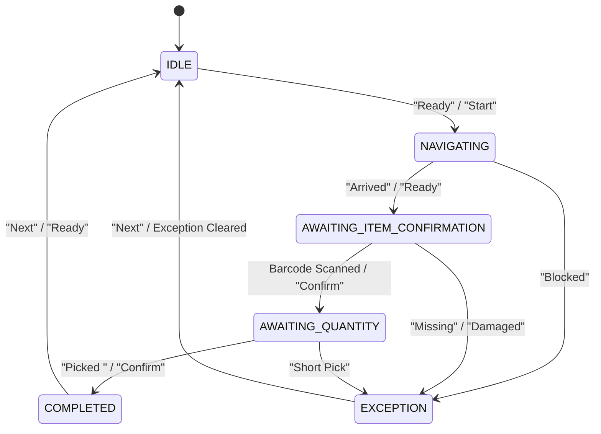

# OpenWES Architecture & Technical Design Document

OpenWES (Open Warehouse Execution System) provides a real-time, high-velocity warehouse execution layer extending the InvenTree inventory system.

---

## 1. System Context & Layering

---

## 2. Warehouse Task Finite State Machine (FSM)

Warehouse tasks enforce strict state transitions to prevent race conditions and illegal floor actions.

### State Machine Transition Rules
- **Atomic Operations**: All state changes transition inside a database transaction (`@transaction.atomic`).
- **Inventory Side Effects**: Only occur when transitioning to `COMPLETED` or `PARTIAL` with non-zero picked quantities.
- **Audit Logging**: Every transition automatically generates an immutable `WarehouseAuditEvent`.

---

## 3. Pick-Path Optimization Engine

Floor walking time accounts for up to 60% of warehouse operational labor. OpenWES provides modular routing algorithms:

### Algorithms
1. **S-Shape (Snake) Heuristic** (Default):
   - Orders picking locations across parallel aisles in an alternating "S" or "Z" pattern.
   - Operators traverse aisle 1 south-to-north, aisle 2 north-to-south, eliminating aisle re-entries and backtracking.
2. **Nearest-Neighbor TSP Heuristic**:
   - Greedy Euclidean distance ordering for cross-docking or non-standard floor geometries.
3. **Zonal Coordinate Ordering**:
   - Strict lexicographical ordering by `Zone -> Aisle -> Bay -> Level`.

---

## 4. Multi-Factor Task Assignment Engine

Instead of naive FIFO assignment, OpenWES utilizes a multi-factor score:

$$\text{Total Score} = (0.35 \times D_{\text{travel}}) + (0.30 \times W_{\text{queue}}) + (0.20 \times P_{\text{order}}) + (0.15 \times Z_{\text{transit}})$$

- **$D_{\text{travel}}$ (35%)**: Manhattan distance from operator's current location to pick bin.
- **$W_{\text{queue}}$ (30%)**: Current active backlog assigned to the operator.
- **$P_{\text{order}}$ (20%)**: Order priority weighting (Critical > High > Medium > Low).
- **$Z_{\text{transit}}$ (15%)**: Zone affinity bonus (0 penalty if inside the same zone; positive transit penalty if switching zones).

Every assignment produces an explainable decision log stored in `TaskAssignment.reason`.

---

## 5. Offline Synchronization & Idempotency Architecture

---

## 6. Voice-Directed Picking FSM

The voice subsystem abstracts browser Web Speech API and offline Vosk engines behind a strict contextual state machine:

---

## 7. Audit Logging & Compliance

- Every floor event records an immutable `WarehouseAuditEvent`.
- Log entries include timestamp, actor ID, affected task, source/destination bin, part/SKU, and full JSON payload diffs (previous stock vs. new stock, scanned barcode string, exception notes).
- Audit logs are read-only and indexed for instantaneous supervisor search and compliance reviews.
